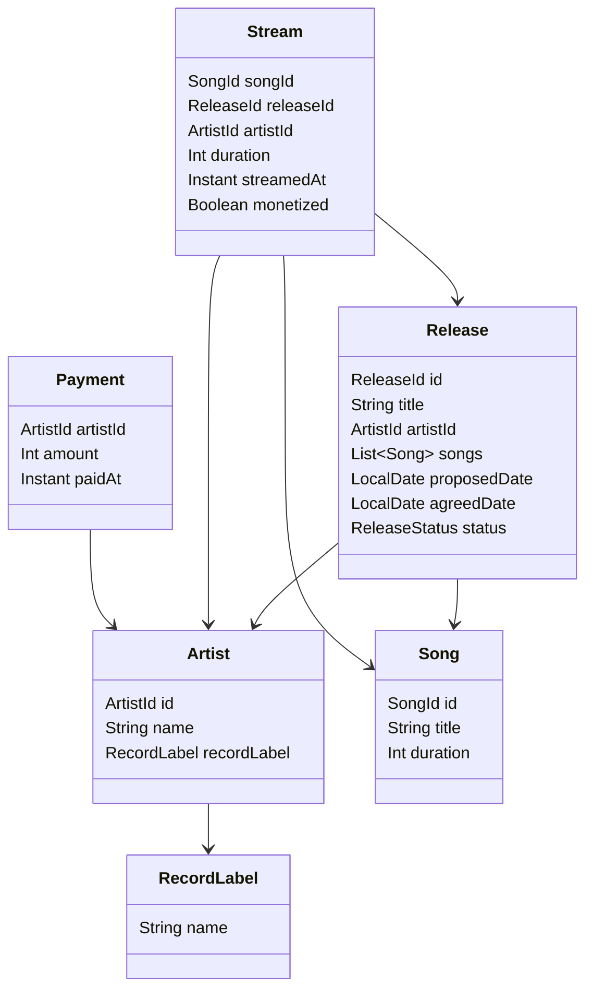

# Music Distribution System

This is a prototype implementation of a core module for a music distribution system. It demonstrates domain modeling, core service logic, and behavior implementation using Scala and hexagonal architecture.

## Features

- Artists can add songs to a release
- Propose and agree on a release date
- Distribute songs when release date is reached
- Streamed songs ≥ 30s are monetized
- Stream report generation for artists
- Artists can file for payment
- Artists can withdraw a release (disabling streaming)
- Song search using Levenshtein distance

## Tech Stack

- Scala (JVM)
- Hexagonal architecture
- In-memory storage for all repositories
- Unit tests using ScalaTest

## Project Structure
<pre> <code> src/ 
  ├── core/ 
  │ ├── model/ # Domain entities 
  │ ├── service/ # Business logic 
  │ └── port/ # Repository interfaces 
  ├── adapter/ # In-memory adapter implementations 
  ├── AppModule/ 
  └── Main.scala # End-to-end demo 
 
  test/ 
  └── scala/ # Unit tests </code> </pre>

## Data Model Relationship



## How to Run 
1. Clone the repository
2. Run demo with:
   ```bash
   sbt run

3. Run tests with
   ```bash
   sbt test

## Assumptions
- All streams are uniquely recorded; no duplication or fraud checks are implemented
- Time-based triggers (e.g. activating release on date) are simulated manually
- No persistent database or concurrency handling included
- Error handling is simplified via a general-purpose AppError type
