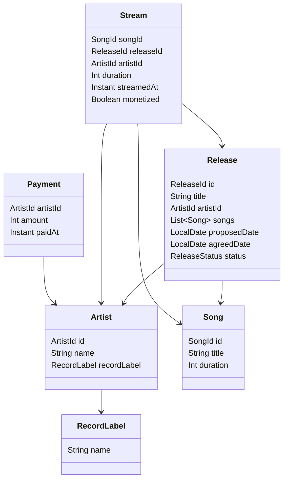

# Music Distribution System

This is a prototype implementation of a core module for a music distribution system. It demonstrates domain modeling, core service logic, and behavior implementation using Scala and hexagonal architecture.

## Features

- Artists can add songs to a release
- Propose and agree on a release date
- Distribute songs when release date is reached
- Streamed songs ≥ 30s are monetized
- Stream report generation for artists
- Artists can file for payment
- Artists can withdraw a release (disabling streaming)
- Song search using Levenshtein distance

## Tech Stack

- Scala 3.3.1
- Hexagonal architecture
- In-memory storage for all repositories
- Unit tests using ScalaTest

## Project Structure
<pre> <code> src/ 
  ├── core/ 
  │ ├── model/ # Domain entities 
  │ ├── service/ # Business logic 
  │ └── port/ # Repository interfaces 
  ├── adapter/ # In-memory adapter implementations 
  ├── AppModule/ 
  └── Main.scala # End-to-end demo 
 
  test/ 
  └── scala/ # Unit tests </code> </pre>

## Data Model Relationship



## How to Run 
1. Clone the repository
2. Run demo with:
   ```bash
   sbt run

3. Run tests with
   ```bash
   sbt test

## Assumptions & Production Readiness
- All streams are uniquely recorded; no duplication or fraud checks are implemented.
- distributeIfDue feature is simulated manually - may be enhanced by introducing some background jobs.
- The In-Memory storage needs to be swapped out by persistent storage, with connection pooling if needed.
- The driven part adapter needs to be implemented to expose core logic, depends on how app will interact with other systems.
  - Will introduce stricter validations, its own entity types and clear contract specs.
- We have used AppModule to wire all up to keep it simple, but in reality we can use some DI framework.
- The search demo needs to be replaced by dedicated search engine solution, to scale it better.
- The core is covered by Unit tests, but we need integration tests once we start adding dependencies (DB, Queues, etc).
- The Error handling is very basic, for more complex flows and situation we can introduce richer error types.
- So far there is no logging added, for production, we need some observability, health checks, structured log, metrics, traces.
- No CI/CD setup for the app.
